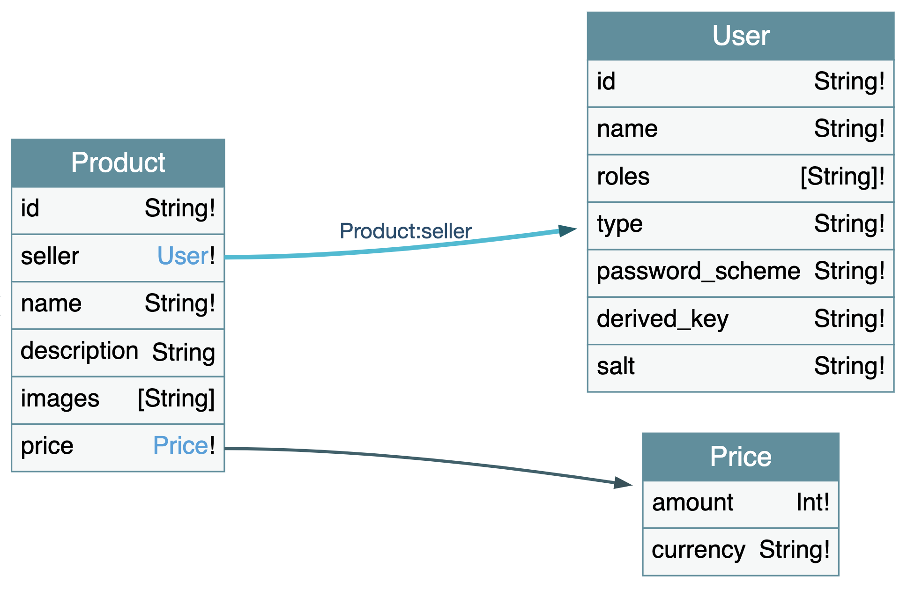

# API reference

## Database relationships



# API routes

## Products

### List all products

`GET /api/products`

#### Parameters

No parameters.

#### Response

```js
{
  total_rows: 5,
  offset: 0,
  rows: [
    {
      id: '36f300831510a53137c3670120000183',
      key: '36f300831510a53137c3670120000183',
      value: {
        rev: '1-aa6c1957ef8fe2c6f6617a3f562d6de6',
      },
      doc: {
        _id: '36f300831510a53137c3670120000183',
        _rev: '1-aa6c1957ef8fe2c6f6617a3f562d6de6',
        seller: 'admin',
        name: 'Banana',
        description: 'A curvy yellow fruit.',
        images: [
          'https://image.shutterstock.com/image-photo/bananas-grapes-600w-518328943.jpg',
        ],
        price: {
          amount: 299,
          currency: 'sgd',
        },
      },
    },
    {...},
  ],
}
```

### List all products for a specific user

`GET /api/products/seller/:name`

#### Parameters

No parameters.

#### Response

```js
{
  docs: [
    {
      _id: '36f300831510a53137c3670120000183',
      _rev: '1-aa6c1957ef8fe2c6f6617a3f562d6de6',
      seller: 'admin',
      name: 'Banana',
      description: 'A curvy yellow fruit.',
      images: [
        'https://image.shutterstock.com/image-photo/bananas-grapes-600w-518328943.jpg',
      ],
      price: {
        amount: 299,
        currency: 'sgd',
      },
    },
    {...},
  ],
}
```

### List products by search term

`GET /api/products/q/:term`

#### Parameters

No parameters.

#### Response

```js
{
  docs: [
    {
      _id: '36f300831510a53137c3670120000183',
      _rev: '1-aa6c1957ef8fe2c6f6617a3f562d6de6',
      seller: 'admin',
      name: 'Banana',
      description: 'A curvy yellow fruit.',
      images: [
        'https://image.shutterstock.com/image-photo/bananas-grapes-600w-518328943.jpg',
      ],
      price: {
        amount: 299,
        currency: 'sgd',
      },
    },
    {...},
  ],
}
```

## Users

### Get user session

`GET /api/session`

#### Parameters

No parameters.

#### Response

```js
{
  name: 'testr@test.de',
  roles: ['user'],
}
```

### Sign up a new user

`POST /api/signup`

#### Parameters

- name (`required`): A unique name for the user, e.g. their email address.
- password (`required`): The user's password.

#### Response

```js
{
  name: 'testr@test.de',
  roles: ['user'],
}
```

### Log in a user

`POST /api/login`

#### Parameters

- name (`required`): A unique name for the user, e.g. their email address.
- password (`required`): The user's password.

#### Response

```js
{
  name: 'testr@test.de',
  roles: ['user'],
}
```

### Log out a user

`GET /api/logout`

#### Parameters

No parameters.

#### Response

```js
{
  ok: true,
}
```
